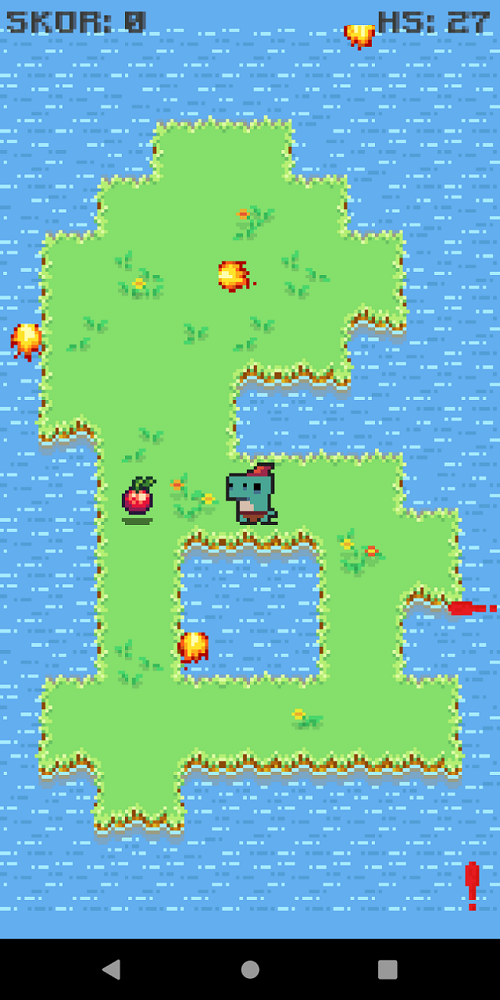
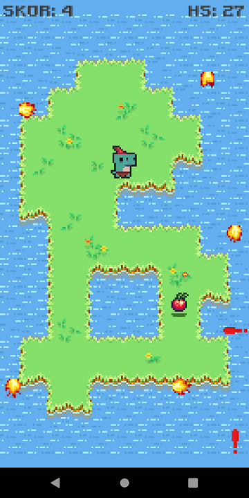

# Leep
Leep is a mobile game developed with libGDX.

## About Game
Your aim is basically collecting fruits while trying to not get shot by anything. You move character by swiping to direction you want. 
As you play game gets harder. (Fireballs get faster)

## Screenshots

## Download
[Download](https://www.dropbox.com/s/0s6yn88z5d9tnu8/leep-release.apk?dl=0) APK.

## License
This project is licensed under the MIT License, see the LICENSE.md file for details.